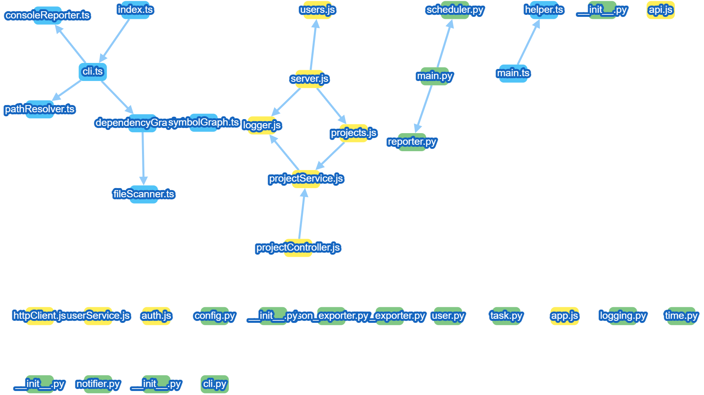

# Cross-Project Impact Analysis (CPIA) — VS Code Extension

CPIA helps you **visualize cross-file relationships** in a codebase by building an **explainable dependency graph** and a **symbol-level (AST-based) index**.



**MVP today**
- Generates a **file-level dependency graph** (e.g., imports/requires) for quick cross-file understanding.
- Builds a **symbol-level index** (AST-based) to support “where is this defined/used?” style navigation.
- Ships as a **VS Code extension** with a repeatable workflow: scan → build graph → visualize.

> Public repo focus: **structured documentation**, **reliable deliverables**, **iterative milestones**.

---

## What you get (in 30 seconds)
- A clear **dependency graph** to see how files/modules connect.
- A practical foundation for **cross-file code comprehension** and future analysis extensions.

---

## Quick Start (Developer Mode)
> Fastest way to try CPIA is running it in VS Code’s Extension Development Host.

### Prerequisites
- VS Code
- Node.js (LTS recommended)
- Git (optional, but recommended)

### Run locally
1. Clone:
   ```bash
   git clone https://github.com/zsun360/cross-project-impact-analysis.git
   cd cross-project-impact-analysis
   ```
2. Install dependencies:
   ```bash
   npm install
   ```
3. Build / compile (use what exists in your repo):
   ```bash
   npm run build
   ```
   If `build` is not defined, try:
   ```bash
   npm run compile
   ```
4. Launch the extension:
   - Open the repo in VS Code
   - Press **F5** to open the **Extension Development Host**
5. In the Dev Host:
   - Open a workspace (any Git repo / sample project)
   - Open Command Palette: `Cmd/Ctrl + Shift + P`
   - Search **“CPIA”** (or **“Impact”**) and run the available graph commands

> Tip: If your repo is multi-root (client/server folders), run `npm install` in each folder that contains a `package.json`.

---

## How it works (high level)
1. **Scan workspace**: locate source files and resolve module/import relations.
2. **Build graphs**:
   - File-level dependency graph (module relationships)
   - Symbol-level index (AST-based) for code structure
3. **Visualize**: render graphs in VS Code (Webview).

---

## Roadmap (public)
- Better language coverage and import-resolution edge cases
- More graph UX polish (filters, search, grouping)
- Testing + CI for stable contributions

---

## Repo Structure (at a glance)
- `core/` — VS Code extension components
- `server/` — analysis pipeline (scan, parse, graph build)
- `docs/` — screenshots and documentation

---

## Contributing
Issues and PRs are welcome. For bugs, please include:
- OS + VS Code version
- steps to reproduce
- expected vs actual behavior
